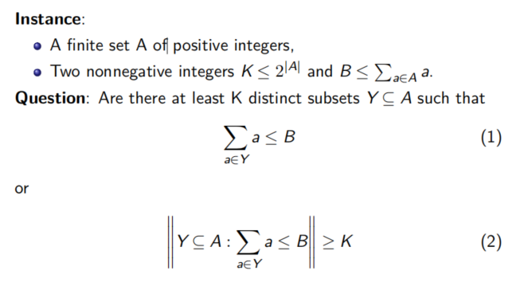

# [13--完全多项式非确定性问题 算法设计与分析]高级算法大模型辅助学习

```
title: [13--完全多项式非确定性问题 算法设计与分析]高级算法大模型辅助学习
author:
    - name: 王赫^[2024244022,计算机科学与技术]

# toc: false
# toc-title: "目录"

filters:
  - scholarly-metadata.lua
  - author-info-blocks.lua

```

**Q01：对典型 NPC 问题列表 进行介绍说明**

- prompt：（Boolean satisfiability problem (3-SAT)、N-puzzle、Knapsack problem、Hamiltonian path problem、Traveling salesman problem、Subgraph isomorphism problem、Subset sum problem、Clique problem、Vertex cover problem、Independent set problem、Graph coloring problem。）
- model_name：ChatGPT
- model_version：GPT-4o
- response：
  
    典型的 NPC 问题（即 NP-complete 问题）是指一类特别重要和复杂的计算问题。解决这些问题的解法目前都没有已知的多项式时间算法，而找到一种多项式时间算法来解决其中任意一个问题，就可以用类似的方式解决所有 NP 问题。以下是一些典型的 NPC 问题的简要介绍：
    
    1. **Boolean satisfiability problem (3-SAT)**
        - **描述**：给定一个由布尔变量组成的布尔公式，判断是否存在一种变量赋值使得整个公式为真。3-SAT 是一个特定的 SAT 问题，其中每个子句恰好包含三个文字（变量或其否定）。
        - **示例**：公式 (x1 ∨ ¬x2 ∨ x3) ∧ (¬x1 ∨ x2 ∨ x4) ∧ (¬x3 ∨ x4 ∨ ¬x1)，判断是否有可能的变量赋值使得整个公式为真。
    2. **N-puzzle**
        - **描述**：将一个由数字（或图片）组成的 N×N 的拼图从初始状态移动到目标状态，每次只能移动一个拼块到空位。常见的例子是 15-puzzle（4x4 拼图）。
        - **示例**：给定一个初始状态和目标状态，通过移动拼块解决拼图。
    3. **Knapsack problem**
        - **描述**：在一个容量有限的背包中，选择若干物品，使得物品的总价值最大化。每个物品有一个重量和价值。
        - **示例**：有一个背包容量为50，有5个物品（重量和价值分别为 10/60, 20/100, 30/120, 40/160, 50/200），选择哪些物品可以使总价值最大化。
    4. **Hamiltonian path problem**
        - **描述**：在一个图中找到一条通过每个顶点一次且仅一次的路径。
        - **示例**：给定一个图，判断是否存在这样的路径经过所有顶点一次且仅一次。
    5. **Traveling salesman problem (TSP)**
        - **描述**：给定一组城市及城市间的距离，找出一条经过每个城市一次并且回到起点的最短路径。
        - **示例**：给定城市间的距离矩阵，找出一条最短路径访问所有城市并返回起点。
    6. **Subgraph isomorphism problem**
        - **描述**：判断一个图中是否存在一个子图，其结构与另一个较小的图同构。
        - **示例**：给定两个图，判断较小的图是否是较大图的子图。
    7. **Subset sum problem**
        - **描述**：给定一组整数，判断是否存在一个非空子集，使得子集的和等于一个给定的数。
        - **示例**：给定一组数字 {3, 34, 4, 12, 5, 2} 和目标和 9，判断是否存在一个子集和为 9。
    8. **Clique problem**
        - **描述**：在一个图中找到一个完全子图（即任意两个顶点都有边相连），其大小至少为 k。
        - **示例**：给定一个图和一个整数 k，判断是否存在一个包含 k 个顶点的完全子图。
    9. **Vertex cover problem**
        - **描述**：在一个图中找到一个顶点的集合，使得图中每条边至少有一个端点在该集合中。
        - **示例**：给定一个图和一个整数 k，判断是否存在一个包含 k 个顶点的集合，使得每条边至少有一个端点在该集合中。
    10. **Independent set problem**
        - **描述**：在一个图中找到一个顶点的集合，使得集合中任意两个顶点之间都没有边相连。
        - **示例**：给定一个图和一个整数 k，判断是否存在一个包含 k 个顶点的独立集。
    11. **Graph coloring problem**
        - **描述**：给定一个图，用最少的颜色为图中的每个顶点着色，使得相邻的顶点颜色不同。
        - **示例**：给定一个图和颜色数 k，判断是否能用 k 种颜色为图的顶点着色。
    
    这些问题不仅在理论计算机科学中具有重要地位，也在实际应用中经常出现，例如优化、网络设计、资源分配等领域。解决这些问题的方法和策略对提升计算和算法能力有重要意义。
    

**Q02：总结下P类问题、NP类问题、NPC类问题、NPH类问题，以及其他相关概念间的关系**

- prompt：（包括完整的提示设计）
- model_name：ChatGPT
- model_version：GPT-4o
- response：
  
    在计算复杂性理论中，P类问题、NP类问题、NP完全问题（NPC类问题）和NP困难问题（NPH类问题）是一些重要的概念，它们帮助我们理解不同类型计算问题的复杂性和可解性。以下是这些概念的简要总结以及它们之间的关系：
    
    ### P类问题（Polynomial-time problems）
    
    - **定义**：可以在多项式时间内（即，时间复杂度为多项式函数的时间）解决的问题。
    - **特点**：这些问题有已知的高效算法，可以在合理的时间内解决，即使对于大型输入。
    - **例子**：排序问题（如快速排序、归并排序）、最短路径问题（如Dijkstra算法）、图的连通性问题。
    
    ### NP类问题（Nondeterministic Polynomial-time problems）
    
    - **定义**：其解可以在多项式时间内由一种“非确定性”算法验证的问题。这意味着，如果给定一个候选解，可以在多项式时间内验证其是否正确。
    - **特点**：虽然不一定能在多项式时间内找到解，但一旦提供了解，可以在多项式时间内验证。
    - **例子**：旅行商问题（TSP）、布尔可满足性问题（SAT）。
    
    ### NPC类问题（NP-complete problems）
    
    - **定义**：NP类中的一个子集，具有以下特点：
        1. **NP难度**：每个NP问题都可以在多项式时间内归约到它，即它至少和所有NP问题一样难。
        2. **NP性**：它本身也是NP问题，解可以在多项式时间内验证。
    - **特点**：如果找到一个NP完全问题的多项式时间解法，那么所有NP问题都可以在多项式时间内解决。
    - **例子**：3-SAT问题、哈密顿路径问题、顶点覆盖问题。
    
    ### NPH类问题（NP-hard problems）
    
    - **定义**：至少和NP问题一样难的问题。NP困难问题不要求必须在NP类中，即它们不一定要在多项式时间内验证解。
    - **特点**：这些问题可能比NP问题更难，甚至无法在多项式时间内验证其解。
    - **例子**：一般的TSP（不要求返回到起点）、一些组合优化问题。
    
    ### 其他相关概念
    
    - **NP问题的归约**：将一个问题转换为另一个问题的过程，保证转换后的问题解的难度不高于原问题。这用于证明一个问题是否为NP完全问题。
    - **Co-NP问题**：这些问题的否定（即，解的不存在性）可以在多项式时间内验证。一个问题是否属于Co-NP是通过验证其否定命题的多项式时间性来确定的。
    
    ### 概念间的关系
    
    - **P vs NP**：P类问题是NP类问题的一个子集。P中的问题不仅可以在多项式时间内验证解，还可以在多项式时间内找到解。
    - **NP vs NP-Complete**：所有NP完全问题都是NP问题的子集。NP完全问题是NP中最难的问题。
    - **NP-Complete vs NP-Hard**：NP完全问题同时是NP困难问题，而NP困难问题不一定是NP问题。
    
    总结起来：
    
    - **P类问题**是可在多项式时间内解决的。
    - **NP类问题**是可在多项式时间内验证解的。
    - **NPC类问题**是NP问题中最难的，且所有NP问题都可以归约为它们。
    - **NPH类问题**是至少和NP问题一样难，但不一定能在多项式时间内验证解。
    
    理解这些概念及其关系，对于研究计算问题的复杂性和寻找有效算法具有重要意义。
    

**Q03：证明 K th largest subset problem 问题是 NP-hard 问题，解释无法证明是否属于  NP 类问题。**

- prompt：



- model_name：ChatGPT
- model_version：GPT-4o
- response：
  
    ### 证明 Kth Largest Subset Problem 是 NP-hard 的原因
    
    **问题定义：**
    
    - **实例**：给定一个有限的正整数集合 A，以及两个非负整数 $K \leq 2^{|A|}$ 和 $B \leq \sum_{a \in A} a$。
    - **问题**：是否至少存在 K 个不同的子集 Y⊆A，使得 $\sum_{a \in Y} a \leq B$？
    
    ### 证明步骤
    
    1. **选择一个已知的 NP-hard 问题**：
        - 选择经典的 NP-hard 问题，如 Subset Sum 问题。
        - **Subset Sum 问题定义**：
            - **实例**：一个集合 A 和一个目标和 B。
            - **问题**：是否存在一个子集 Y⊆A，使得 $\sum_{a \in Y} a = B$？
    2. **构建归约**：
        - 我们需要将 Subset Sum 问题归约到 Kth Largest Subset Problem。
        - 给定一个 Subset Sum 问题实例 (A,B)，我们构造一个 Kth Largest Subset Problem 实例如下：
            - 令 K=1。
            - 保持集合 A 和目标和 B 不变。
        - 这样，Kth Largest Subset Problem 的实例为 (A,K=1,B)。
    3. **验证归约的正确性**：
        - **Subset Sum 问题有解**：
            - 如果存在一个子集 Y⊆A，使得 $\sum_{a \in Y} a = B$，那么这个子集也满足 $\sum_{a \in Y} a \leq B$。
            - 因此，Kth Largest Subset Problem 的实例有至少一个子集满足条件，即有至少 K=1 个子集满足 $\sum_{a \in Y} a \leq B$
        - **Subset Sum 问题无解**：
            - 如果不存在这样的子集 Y，那么对于任何子集 Y⊆A， $\sum_{a \in Y} a \neq B$。
            - 因此，Kth Largest Subset Problem 的实例也不会有满足条件的子集。
    4. **归约的时间复杂度**：
        - 这个归约过程是在多项式时间内完成的，因为只是重新定义了一些参数并没有涉及复杂的计算。
    
    综上所述，通过将 Subset Sum 问题归约到 Kth Largest Subset Problem，可以证明 Kth Largest Subset Problem 是 NP-hard 的。
    
    ### 无法证明 Kth Largest Subset Problem 是否属于 NP 类问题的原因
    
    为了证明一个问题属于 NP 类问题，需要证明它的解可以在多项式时间内验证。对于 Kth Largest Subset Problem，验证解的过程存在以下挑战：
    
    1. **解的验证过程**：
        - 验证是否存在至少 K 个不同的子集 Y⊆A，使得 $\sum_{a \in Y} a \leq B$，可能需要枚举和比较所有子集。
        - 对于一个集合 A，子集的数量为 $2^{|A|}$。验证这些子集需要指数时间。
    2. **排序和计数的复杂性**：
        - 验证是否存在至少 K 个子集满足条件，通常需要将所有子集按照元素和进行排序。
        - 这个排序过程和比较过程的时间复杂度为 $O(2^{|A|} \log(2^{|A|}))$。
    3. **验证难度的例证**：
        - 假设我们有一个候选解（如一个符合条件的子集），验证这个子集是否是第 K 大子集，可能需要比较与其他所有子集的关系。
        - 这个过程无法在多项式时间内高效完成，因此难以设计出多项式时间验证算法。
    
    由于这些原因，尽管我们可以证明 Kth Largest Subset Problem 是 NP-hard 的，但无法证明它是否属于 NP 类问题。验证解的复杂性和排序问题使得这类证明变得极为困难，甚至可能无法实现。因此，尽管我们知道 Kth Largest Subset Problem 至少和 NP 问题一样难，但其具体是否属于 NP 类仍然是一个未解的问题。
    

**Q04：为什么说，所有的 NPC 问题关于多项式规约是封闭的(自反的、对称的和传递的)？**

- Definition
如果所有的 NP 类问题都可以多项式地规约到问题 Q，那么称 Q为 NP-hard 问题。
如果问题 Q 是 NP-hard 问题并且也 NP 类问题，称 Q 为 NPComplete(NPC) 问题
- model_name：ChatGPT
- model_version：GPT-4o
- response：
  
    要理解为什么所有的 NP 完全（NPC）问题关于多项式规约是封闭的，我们需要先明确以下几个定义：
    
    1. **NP 类问题**：所有在多项式时间内可以验证解的决策问题。
    2. **NP-hard 问题**：所有的 NP 类问题都可以多项式时间规约到它的决策问题。
    3. **NP 完全（NPC）问题**：如果一个问题既是 NP-hard 问题又是 NP 类问题，则它是 NP 完全问题。
    
    ### 多项式规约的定义
    
    多项式规约（Polynomial-time reduction）是指能够在多项式时间内把一个问题转换为另一个问题。对于问题 A 和 B，如果存在一个多项式时间算法，可以把任意 A 的实例转换为 B 的实例，那么称 A 可以多项式规约到 B。
    
    ### 多项式规约的封闭性
    
    多项式规约的封闭性意味着，NPC 问题在多项式规约下是自反的、对称的和传递的。
    
    1. **自反性（Reflexivity）**：
        - 对于任何 NPC 问题 Q ，都可以把 Q 自己规约到自己。
        - 这显然是成立的，因为我们只需要一个恒等函数来完成这个转换。
    2. **对称性（Symmetry）**：
        - 如果 A 可以多项式规约到 B，且 B 是一个 NPC 问题，那么 B 也可以多项式规约到 A。
        - 然而，严格意义上，单个多项式规约通常不是对称的。但如果 A 和 B 都是 NPC 问题，那么它们彼此可以多项式规约。这是因为所有 NP 类问题都可以多项式规约到任何一个 NPC 问题，所以两个 NPC 问题之间存在双向规约。
    3. **传递性（Transitivity）**：
        - 如果 A 可以多项式规约到 ，且 B 可以多项式规约到 C ，那么 A 也可以多项式规约到 C。
        - 这是因为如果存在两个多项式时间转换 f 和 g，分别把 A 规约到 B 和 B 规约到 C，那么 A 可以通过 h(x) = g(f(x)) 在多项式时间内规约到 C 。
    
    ### 为什么 NPC 问题关于多项式规约是封闭的
    
    假设 PP 和 QQ 都是 NPC 问题。我们需要验证以下几点：
    
    1. **自反性**：
        - 任意 NPC 问题 Q 可以规约到自己，使用恒等函数，这显然是成立的。
    2. **对称性**：
        - 由于 P 和 Q 都是 NPC 问题，那么所有 NP 问题都可以多项式规约到 P 和 Q。
        - 所以，P 和 Q 之间存在双向规约，即 $P \leq_p Q$ 和 $Q \leq_p P$。
    3. **传递性**：
        - 如果 $P \leq_p Q$ 和 $Q \leq_p R$，那么通过组合这两个规约，我们可以得到 $P \leq_p R$，这是因为两个多项式时间规约的组合仍然是多项式时间规约。
    
    因此，所有的 NPC 问题在多项式规约下形成一个封闭集，即如果一个问题可以多项式规约到 NPC 问题，那么它也是 NPC 问题。这种封闭性确保了 NPC 问题之间可以通过多项式时间转换，保持其复杂性分类的一致性。
    

**Q05：讲一讲，如果能够找到一个 NPC 问题的多项式算法，那么 P=NP。问题的最前沿的进展。**

- prompt：P= NP 问题位于七个“千僖年数学难题”之首，迄今无解
- model_name：ChatGPT
- model_version：GPT-4o
- response：

### P = NP 问题简介

**P = NP** 是计算复杂性理论中的一个核心问题。这个问题可以表述为：

- **P 类问题**：所有可以在多项式时间内解决的问题。
- **NP 类问题**：所有解可以在多项式时间内验证的问题。

**P = NP 问题** 问的是，是否每一个在多项式时间内能够验证的解（NP 类问题），都可以在多项式时间内找到（P 类问题）？换句话说，是否 P 类问题等于 NP 类问题？

### 如果能够找到一个 NPC 问题的多项式算法，那么 P=NP

**NP 完全（NPC）问题** 是 NP 类问题中的最难问题。具体来说，NPC 问题具有以下特性：

1. **NP 问题**：NPC 问题是 NP 类问题的一部分，解可以在多项式时间内验证。
2. **NP-hard 问题**：所有 NP 问题都可以多项式时间规约到 NPC 问题。

如果我们能够找到一个 NPC 问题的多项式时间算法，意味着我们可以在多项式时间内解决这个 NPC 问题。由于所有 NP 问题都可以多项式时间规约到这个 NPC 问题，这意味着所有的 NP 问题也都可以在多项式时间内解决。因此，**P = NP**。

### P = NP 问题的前沿进展

**P = NP 问题** 是七个“千禧年大奖难题”之一，每一个解答都有一百万美元的奖金。这个问题至今仍未解决，是计算机科学领域最重要和最著名的未解难题之一。

### 研究进展

尽管没有最终的解决方案，但在研究 P = NP 问题的过程中，有许多重要的理论和技术进展：

1. **证明和反证尝试**：
    - 许多数学家和计算机科学家试图证明或反证 P = NP，但迄今为止没有成功。大多数尝试最终被证明是错误的。
2. **特殊情况的研究**：
    - 一些研究集中在特定类型的问题上，尝试在这些特定情况下证明 P = NP 或 P ≠ NP。
    - 例如，布尔可满足性问题（SAT）是第一个被证明为 NP 完全的问题。许多研究工作集中在 SAT 和其变种的算法改进上。
3. **复杂性类之间的关系**：
    - 研究人员还探索了 P 和 NP 之间的其他复杂性类（如 PSPACE，EXPTIME）之间的关系，试图通过这些关系来获得新的洞见。
4. **量子计算的影响**：
    - 量子计算是一个新兴的领域，研究人员在探索量子计算对 P = NP 问题的潜在影响。
    - 尽管量子计算可以加速一些特定问题的求解（如 Shor 算法用于因数分解），但其对 P = NP 问题的总体影响尚不明确。
5. **启发式和近似算法**：
    - 对于许多 NP 完全问题，研究人员开发了启发式和近似算法，尽管这些算法在理论上不能解决 P = NP 问题，但它们在实践中非常有效。
    - 例如，近似算法和随机算法在解决实际问题时提供了有用的工具。

### 现状

目前，P = NP 问题仍然悬而未决。它不仅是计算机科学的核心问题之一，而且对密码学、优化、逻辑和其他领域也有深远的影响。解决 P = NP 问题将是计算机科学的重大突破，可能会彻底改变我们对计算和问题解决的理解。

因此，P = NP 问题仍然是全球数学家和计算机科学家积极研究和探索的前沿课题之一。