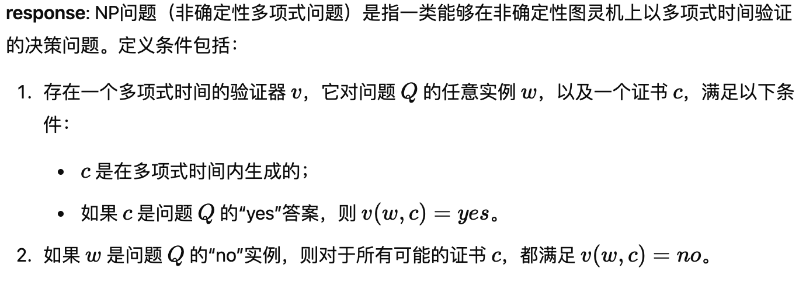
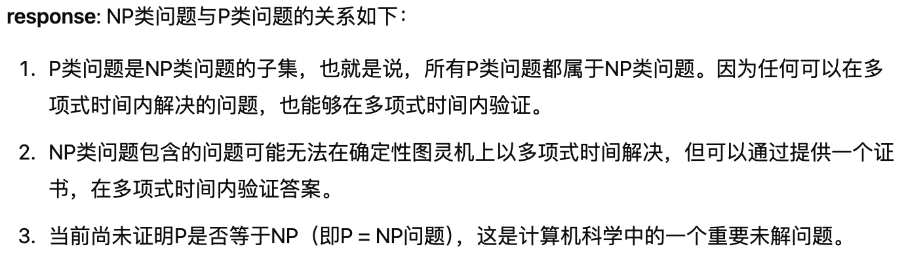
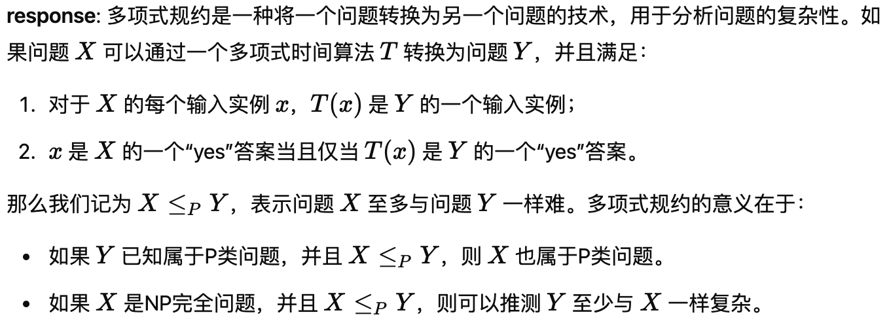
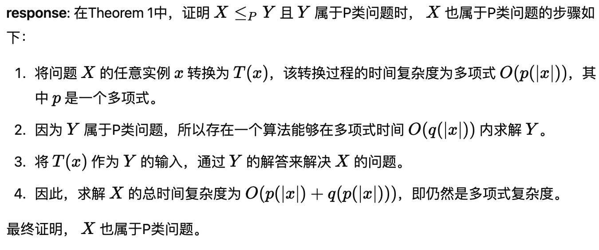
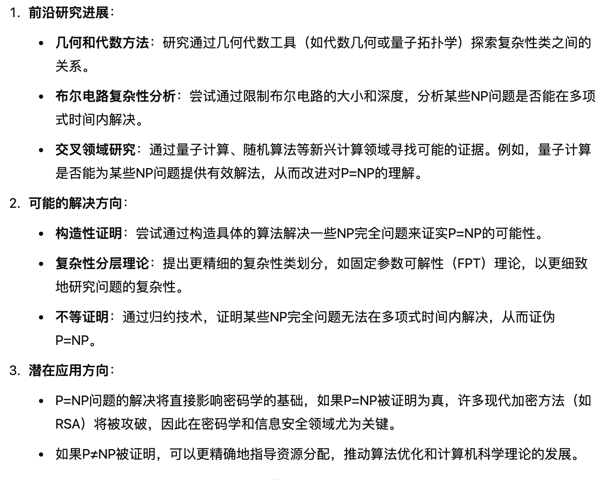

**Q01：什么是NP问题？它的定义条件有哪些？**
- prompt：请详细解释什么是NP问题，以及它的定义条件。可以从验证器、多项式时间和证书的角度说明。
- model_name：GPT-4
- model_version：4.0
- response：

**Q02：NP类问题和P类问题的关系是什么？**
- prompt：请说明NP类问题和P类问题的关系，重点描述P问题是否属于NP问题以及它们的包含关系。
- model_name：GPT-4
- model_version：4.0
- response：

**Q03：什么是多项式规约？它在证明问题复杂性时的作用是什么？**
- prompt：请详细解释什么是多项式规约，并说明它在证明问题复杂性时的作用。结合X ≤P Y的定义，分析规约的意义。
- model_name：GPT-4
- model_version：4.0
- response：

**Q04：Theorem 1中是如何通过多项式规约证明X属于P类问题的？**
- prompt：结合Theorem 1的内容，详细说明如何通过多项式规约证明 𝑋属于P类问题。请从输入转换函数𝑇(𝑥)、复杂性分析的角度分析证明逻辑。
- model_name：GPT-4
- model_version：4.0
- response：

**Q05：P=NP问题的前沿研究有哪些突破？目前有哪些可能的解决方向？**
- prompt：请从计算复杂性理论的角度，说明P=NP问题的前沿研究进展，以及科学家们提出的可能解决方向。
- model_name：GPT-4
- model_version：4.0
- response：

----
