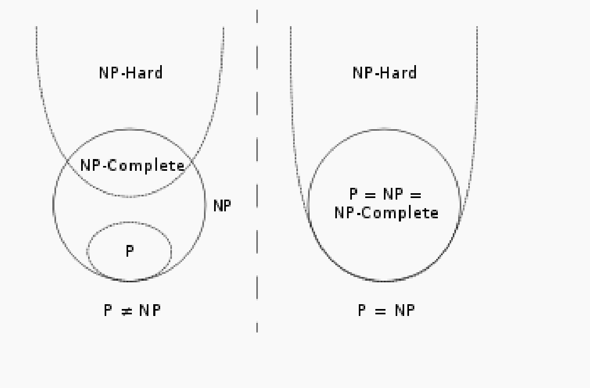

**Q01：停机问题的证明**

- prompt：请解释停机问题为什么不存在通用解决算法

- model_name：ChatGPT

- model_version：ChatGPT4.0

- response：

  停机问题（Halting Problem）是计算机科学中的一个著名问题，由图灵（Alan Turing）在1936年首次提出。这个问题询问是否存在一个通用算法，该算法能够判断任何程序和它的输入是否会停止执行（即在有限的步骤后终止）或将无限期运行。图灵证明了没有这样的算法可以解决所有可能的程序-输入对。

  这里是停机问题不存在通用解决算法的核心原因：

  1. **自指和逻辑悖论**：如果存在一个算法`H`，能够判断任何程序`P`和输入`I`的组合是否会停止，我们可以构造一个称为`D`的程序。`D`的行为是这样的：当输入程序`Q`时，如果`H(Q, Q)`判断`Q`输入`Q`会停止，`D`则进入无限循环；反之，如果`H(Q, Q)`判断`Q`输入`Q`不会停止，`D`则立即停止。然后我们让`D`输入自己，即调用`D(D)`。根据`D`的定义，不论`H(D, D)`返回什么，都会导致矛盾，因为`D`会做出与`H(D, D)`相反的行为。这表明`H`不能存在。
  2. **计算理论的限制**：停机问题实质上揭示了计算理论中的一个基本限制。即不是所有的计算问题都是可解的。有一些问题，像停机问题，本质上是不可判定的。这个发现对于理解计算机的能力和限制具有深远的意义。
  3. **哥德尔不完备定理**：图灵的停机问题证明与哥德尔的不完备定理（Gödel's Incompleteness Theorems）在逻辑上是密切相关的。哥德尔证明了在任何包含基本算术的一致系统中，都存在无法用该系统的规则证明其真或假的命题。停机问题在计算领域提出了一个类似的问题：没有一种方法可以判定所有程序的行为。

  由于这些原因，停机问题被证明是一个不可解的问题，强调了理论计算机科学中的基本限制，并对程序的静态分析和理解有重要的影响。这也是为什么到目前为止，所有的编程和软件开发实践中，仍然需要人类程序员的判断和经验来处理程序可能的无限循环或者不可预见的行为。

**Q02：P和NP**

- prompt：解释什么是P类问题和NP类问题，以及它们之间的关系

- model_name：ChatGPT

- model_version：ChatGPT4.0

- response：

  P类问题和NP类问题是理论计算机科学中的两个核心概念，它们描述了问题的复杂性和计算机求解这些问题的能力。

  **P类问题（Polynomial Time）**

  P类问题是指那些可以通过确定性图灵机在多项式时间内解决的决策问题。多项式时间意味着所需的时间与输入大小的某个多项式成正比。例如，线性时间(O(n)）、平方时间(O(n^2)）等都是多项式时间。简单来说，如果一个问题属于P类，那么存在一个有效的算法，可以在实际可行的时间内解决问题。

  **NP类问题（Nondeterministic Polynomial Time）**

  NP类问题是指那些可以通过非确定性图灵机在多项式时间内解决的决策问题，或者等价地，那些其解可以在多项式时间内被确定性图灵机验证的问题。这意味着，即使找到解的过程可能非常复杂或未知，一旦提供了一个解决方案，验证其正确性的过程则是容易的（即在多项式时间内完成）。

  **它们之间的关系**

  - **包含关系**：显然，所有的P类问题也是NP类问题，因为如果一个问题可以在多项式时间内被解决，那么其解也可以在多项式时间内被验证。因此，我们有
    $$
    P⊆NP
    $$

  - **P vs NP 问题**：一个未解决的问题是P是否等于NP。也就是说，是否每一个可以在多项式时间内验证解的问题都可以在多项式时间内解决？这是计算机科学中的一个重要开放问题，目前普遍的猜想是 
    $$
    P≠NP
    $$

  - **NP完全问题**：在NP类问题中，有一类特别重要的问题称为NP完全问题。这些问题是NP类问题中最难的问题，意味着任何NP问题都可以在多项式时间内归约到任何一个NP完全问题。如果存在一个多项式时间的算法可以解决任意一个NP完全问题，那么 
    $$
    P=NP
    $$

  - **NP困难问题**：NP困难问题定义为至少和NP完全问题一样难的问题。这些问题不一定在NP中，因为它们可能不满足在多项式时间内可验证解的条件。

  总结来说，P类和NP类问题的研究不仅是理论计算机科学的核心，也对算法设计、优化问题解决以及理解计算机科学的限制有深远的影响。P与NP的问题则代表了理论计算机科学中最根本的未解之谜之一。

  

**Q03：Kth largest subset problem**

- prompt：请证明Kth largest subset problem属于NP-hard问题，并给出它为什么不是NP类问题的解释

- model_name：ChatGPT

- model_version：ChatGPT4.0

- response：

  **Kth Largest Subset Problem 的定义是：给定一个整数数组和一个数 kkk，求出所有可能子集按和排序后的第 kkk 大的子集的和。**

  **NP-hard 证明**

  要证明 Kth Largest Subset Problem 属于 NP-hard，可以通过归约已知的 NP-complete 问题到这个问题。一个常用的策略是从类似问题（如 Subset-Sum）开始归约。

  **Subset-Sum 问题**：给定一个集合和一个目标值，判断是否存在一个子集的和恰好等于这个目标值。这是一个经典的 NP-complete 问题。

  **归约步骤**：

  1. 假设我们有一个 Subset-Sum 问题实例，即集合 S 和目标值 t。
  2. 我们构造一个 Kth Largest Subset Problem 的实例，使用相同的集合 S，并设置 k 为 1。
  3. 将 Kth Largest Subset Problem 的目标设置为找到最大的子集和。
  4. 如果 Subset-Sum 的答案是肯定的（即存在一个子集和为t），那么 Kth Largest Subset Problem 的解中，最大的子集和至少为 t（或者更大，如果有多个解）。

  这种归约表明，如果我们能在多项式时间内解决 Kth Largest Subset Problem，那么我们也能解决 Subset-Sum 问题。因此，Kth Largest Subset Problem 至少和 Subset-Sum 一样难，所以它是 NP-hard。

  **为何不是NP类问题**

  NP类问题的核心特性是，对于任何问题实例的一个解，都能在多项式时间内被验证其正确性。Kth Largest Subset Problem 的挑战在于，对于一个给定的和，验证它是否是第 k大的子集和并不是显而易见的。我们需要枚举所有可能的子集和进行排序，然后确定给定的和是否确实是第 k 大的，这一过程不能保证在多项式时间内完成。实际上，子集的数量是指数级的（对于 n 个元素的集合，有 2^n个可能的子集），因此验证过程本身就不是多项式时间可行的。

  因此，尽管验证某个子集的和是很快的，验证一个给定的和是不是第 k 大的子集和通常需要超出多项式时间，所以 Kth Largest Subset Problem 不属于 NP 类问题。

  **结论**

  Kth Largest Subset Problem 是 NP-hard 的，因为它至少和已知的 NP-complete 问题（如 Subset-Sum）一样困难。同时，由于验证一个解的正确性（是否是第 k大）可能超过多项式时间，这个问题不属于 NP 类问题。这说明该问题在计算复杂性理论中的位置，突出了它的计算挑战和理论价值。

**Q04：P=NP问题**

- prompt：从这张图片我们可以得到什么结论？并给出解释

- model_name：ChatGPT

- model_version：ChatGPT4.0

- response：

  这张图片展示了P类问题、NP类问题、NP完全问题和NP困难问题之间的关系。这些概念是理论计算机科学中的复杂性类别，用来描述不同问题的计算难度。从图中可以得出以下结论：

  **图的左半部分**

  - **P类问题**：表示为最内圈的区域，是那些可以在多项式时间内解决的问题。
  - **NP类问题**：包含P类问题，并扩展到那些解可以在多项式时间内被验证的问题。P类问题是NP类问题的一个子集。
  - **NP完全问题**：是NP类问题的一个子集，且所有的NP问题都可以在多项式时间内归约到任何一个NP完全问题。
  - **NP困难问题**：表示为最外层，包含所有至少和NP完全问题一样难的问题。这类问题不必要属于NP类，因为它们可能不满足在多项式时间内可验证解的条件。

  **图的右半部分**

  - 如果**P = NP**，那么所有这些类别将合并为一个，如图右侧所示。这意味着如果可以找到一个多项式时间算法解决任何一个NP完全问题，那么所有NP问题都可以在多项式时间内解决。此外，所有NP困难问题也将等同于NP完全问题。

  **结论和解释**

  1. **包含关系**：P类问题是NP类问题的子集，NP完全问题是NP类问题中具有特殊性质的一部分，而NP困难问题则可能不包括在NP类问题内。
  2. **P vs NP问题**：这是理论计算机科学中的一个未解决问题，图左侧展示了目前普遍接受的关系，即 P≠NPP \neq NP。如果P等于NP（如图右侧所示），这将是一个重大的理论突破，改变我们对算法可解性的理解。
  3. **理论意义**：这些分类帮助研究者理解不同问题的固有计算复杂性，指导算法设计和计算资源分配。

  这张图片有效地总结了这些复杂性类别的定义和它们之间的关系，对于理解计算机科学中的基础理论极为重要。

**Q05：Qname**

- prompt：你认为大模型对证明P=NP问题有什么帮助？换个说法，你认为大模型对数学难题的解决有哪些帮助？

- model_name：ChatGPT

- model_version：ChatGPT4.0

- response：

  大型机器学习模型，如GPT系列和其他先进的AI系统，在数学和逻辑难题的解决方面表现出了一定的潜力。尽管如此，它们在解决P=NP问题或其他深层次的数学理论问题上的直接影响仍然是有限的。下面是大模型在数学难题解决方面的一些潜在帮助：

  **1. 启发式解决方案**

  大模型可以生成启发式解决方案和创新性思路。在面对一些需要创造性思维的问题时，模型可能会提供一种全新的视角或方法，这在传统数学方法中可能不太常见。例如，通过对历史数据、论文和已知理论的广泛学习，模型可能会生成一些独到的见解，为研究者提供新的研究方向。

  **2. 大规模数据分析**

  大模型擅长处理和分析大量数据。在数学研究中，尤其是在统计和概率论领域，模型可以快速处理复杂数据集，发现数据中的模式，这可能会间接帮助解决一些数学问题。

  **3. 自动化推理**

  一些模型被设计用于逻辑推理和符号操作，这可以应用于证明定理或解决数学难题。虽然这些模型通常还没有达到完全独立解决高级数学问题的能力，但它们可以作为研究者的辅助工具，帮助验证想法和简化问题。

  **4. 教育和知识传播**

  大模型在教育领域显示出巨大潜力，能够帮助学生和研究者更好地理解复杂的数学概念和理论。通过交互式学习和个性化解释，这些模型可以使得数学教育更加直观和高效。

  **5. 探索未解问题**

  对于一些未解的数学问题，如P=NP，虽然大模型不太可能直接提供一个严格的数学证明，但它们可以用于测试和探索问题的各种假设，为理论研究提供计算支持和实验验证。

  **结论**

  总的来说，尽管大模型在直接解决高级数学问题，尤其是像P=NP这样的深层理论问题上存在限制，但它们在辅助数学研究、生成创新解决方案、数据分析和教育传播方面提供了实质性的帮助。它们最大的价值可能在于作为人类研究者的工具和伙伴，扩展我们的能力，而不是替代传统的数学研究方法。
