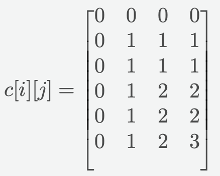

### **Q01: 什么是 Knuth-Morris-Pratt（KMP）算法的核心思想？**

​	•	**Prompt**: 请详细解释 Knuth-Morris-Pratt（KMP）算法的核心思想，包括其关键概念、主要步骤及其时间复杂度分析。

​	•	**Model_Name**: OpenAI GPT

​	•	**Model_Version**: GPT-4.0

​	•	**Response**:

**KMP 算法核心思想**

Knuth-Morris-Pratt（KMP）算法是一种改进的字符串匹配算法，它通过预处理模式字符串避免在匹配失败后重新比较已经匹配的字符，从而实现线性时间复杂度的匹配过程。以下是其核心概念和步骤：

**1. 核心概念**

​	•	**前缀函数（Prefix Function）**

前缀函数 π 是模式字符串中，每个位置处的最长相等前后缀的长度。例如，对于模式串 “ababaca”，其前缀函数数组为 [0, 0, 1, 2, 3, 0, 1]。这个数组表明：

​	•	当模式的第 6 个字符匹配失败时，匹配从第一个字符继续尝试，而无需回退主串。

​	•	**避免主串回溯**

通过使用前缀函数，KMP 算法在发生匹配失败时可以高效地跳转到下一个可能的位置，而不是从头开始。

**2. 算法步骤**

**(1) 前缀函数计算**

​	•	遍历模式字符串，根据前后缀的匹配情况构建前缀函数数组。

​	•	复杂度为 （m 为模式长度）。

**(2) 字符串匹配过程**

​	•	遍历主串，在匹配失败时通过前缀函数指导模式移动。

​	•	每个字符最多被比较两次，因此复杂度为 （n 为主串长度）。

**3. 时间复杂度分析**

​	•	**预处理时间**：构建前缀函数的时间复杂度为 。

​	•	**匹配时间**：每个主串字符被访问一次，复杂度为 。

​	•	**总时间复杂度**：。

**4. 优势与局限性**

**优势**：

​	•	适合处理长主串和短模式串的匹配问题。

​	•	不依赖字符集大小，性能稳定。

**局限性**：

​	•	当主串中包含大量重复子串时，与 Boyer-Moore 算法相比效率稍逊。

**5. 实例讲解**

假设主串为 “abcabcab”，模式串为 “abcab”，使用 KMP 算法：

​	•	预处理构建前缀函数：π = [0, 0, 0, 1, 2]。

​	•	匹配过程逐字符对比，通过 π 避免不必要的回溯，快速找到匹配位置。

### **Q02: 什么是动态规划方法在最长公共子序列（LCS）问题中的应用？**

​	•	**Prompt**: 描述动态规划方法解决最长公共子序列（LCS）问题的过程，包括递归关系推导、算法步骤和复杂度分析。

​	•	**Model_Name**: OpenAI GPT

​	•	**Model_Version**: GPT-4.0

​	•	**Response**:

**LCS 问题简介**

最长公共子序列（LCS）是两个序列之间最长的公共子序列。例如，序列 X = “abcde” 和 Y = “ace” 的 LCS 为 “ace”。

**1. 动态规划方法核心思路**

动态规划通过构建一个二维表来记录子问题的解，从而避免重复计算。基本思想是将问题分解为更小的子问题，并通过递归关系解决每个子问题。

**2. 递归关系推导**

设 c\[i][j] 表示 X 的前 i 个字符和 Y 的前 j 个字符的 LCS 长度：

​	1.	若 x[i] == y[j] ，则 c\[i][j] = c\[i-1][j-1] + 1 。

​	2.	若x[i] 不等于 y[j]  ，则 c\[i][j] = max(c\[i-1][j], c\[i][j-1]) 。

​	3.	边界条件：当 i = 0 或 j = 0 时，LCS 长度为 0，即 c\[i][0] = 0 , c\[0][j] = 0 。

**3. 算法步骤**

**(1) 初始化二维表**

​	•	创建一个大小为 (m+1) *(n+1) 的二维数组c。

**(2) 填表**

​	•	遍历 X 和 Y 的每个字符，利用递归关系逐步填表。

**(3) 回溯构造 LCS**

​	•	从表格右下角开始，沿着回溯路径找到 LCS。

**4. 时间与空间复杂度**

​	•	时间复杂度： O(mn) （m 和 n 分别为 X 和 Y 的长度）。

​	•	空间复杂度：标准方法为  O(mn) ；可通过滚动数组优化为  O(min(m, n)) 。

**5. 实例演示**

假设 X = “abcde”，Y = “ace”：

​	•	初始化表格：

​	•	最终 LCS 长度为 3，回溯路径得出 LCS 为 “ace”。

### **Q03: KMP 算法与 Boyer-Moore 算法的性能与适用场景对比**

​	•	**Prompt**: 详细比较 KMP 算法与 Boyer-Moore 算法的核心思想、性能和适用场景。

​	•	**Model_Name**: OpenAI GPT

​	•	**Model_Version**: GPT-4.0

​	•	**Response**:

**KMP 和 Boyer-Moore 算法简介**

两者都是经典的字符串匹配算法，但在性能优化和适用场景上各有不同。

**1. 核心思想**

​	•	**KMP 算法**：利用前缀函数避免主串的回溯，保证每个字符最多比较两次。

​	•	**Boyer-Moore 算法**：通过跳跃扫描主串（字符表和坏字符规则），利用模式串尾部的信息减少匹配次数。

**2. 性能分析**

​	•	**KMP**：时间复杂度为  O(n + m) ，性能稳定。

​	•	**Boyer-Moore**：最优情况下为  O(n/m) ，最差情况退化到  O(nm) 。

**3. 应用场景**

​	•	**KMP**：适用于模式串较短、主串字符重复度较高的情况。

​	•	**Boyer-Moore**：适用于主串较长、字符集大且模式串较长的情况。

**4. 综合对比**

**算法**	**时间复杂度**	**优势**	**劣势**

KMP	 O(n + m) 	适合所有情况，性能稳定	对长模式串效率较低

Boyer-Moore	 O(n/m) 	长模式串和稀疏匹配场景下效率极高	最差情况下退化严重

**5. 实际应用**

​	•	文本编辑器中的查找功能更倾向使用 Boyer-Moore。

​	•	生物信息学中的模式匹配通常使用 KMP，因其对重复数据性能稳定。

### **Q04: 如何优化多序列比对（MSA）中动态规划的计算效率？**

​	•	**Prompt**: 针对多序列比对（Multiple Sequence Alignment, MSA）问题，详细描述如何优化动态规划算法的计算效率，包括常用方法及其适用场景。

​	•	**Model_Name**: OpenAI GPT

​	•	**Model_Version**: GPT-4.0

​	•	**Response**:

多序列比对（MSA）是生物信息学中一项重要任务，其目的是对三个或以上序列进行比对，使得同源性区域得以对齐。然而，传统的动态规划算法在 MSA 中计算复杂度和空间需求随序列数量急剧增加，需要进行优化。

**1. MSA 中动态规划的复杂度分析**

​	•	对于 k 个长度为 n 的序列，标准动态规划方法的时间复杂度为 O(n^k) ，空间复杂度为 O(n^k) 。

​	•	这种指数级增长导致在实际应用中无法对大量序列进行比对。

**2. 常用优化方法**

(1) **渐进式比对（Progressive Alignment）**

​	•	**思想**：逐步构建多序列比对，先对最相似的序列进行两两比对，然后将结果与其他序列逐步比对。

​	•	**实现步骤**：

​	1.	计算所有序列两两之间的相似性，生成距离矩阵。

​	2.	使用距离矩阵构建引导树（Guide Tree），如 UPGMA 或 Neighbor-Joining 方法。

​	3.	按引导树的顺序，逐步进行序列和比对的比对。

​	•	**优点**：显著降低计算复杂度，适用于大规模数据。

​	•	**缺点**：早期比对的误差可能会在后续步骤中累积。

(2) **迭代优化（Iterative Refinement）**

​	•	**思想**：在初步比对完成后，通过反复调整比对结果来提高比对质量。

​	•	**方法**：

​	•	随机移除某些序列并重新比对，观察是否能改善整体得分。

​	•	结合动态规划重新调整比对结果。

​	•	**适用场景**：需要更高比对精度但计算资源有限的情况。

(3) **空间优化**

​	•	采用滚动数组技术，仅保存当前行和上一行的数据，减少内存使用。

​	•	在长序列比对中显著降低空间复杂度。

(4) **启发式方法**

​	•	利用如 CLUSTAL、MUSCLE 等工具，通过引入启发式算法避免全局搜索：

​	•	CLUSTAL 使用渐进式方法构建引导树。

​	•	MUSCLE 使用 k-mer 频率快速估算相似性，从而加速比对。

(5) **并行化计算**

​	•	将动态规划算法分割成可并行的子任务，利用多核处理器或 GPU 提高计算速度。

​	•	适用于云计算或高性能计算环境。

**3. 优化后算法的适用场景**

​	•	**渐进式比对**：适合较多序列且精度要求不高的情况，如初步筛选。

​	•	**迭代优化**：用于需要高精度比对的关键任务，如蛋白质结构预测。

​	•	**空间优化和并行化**：适合长序列和大规模数据集的比对。

**4. 示例：CLUSTAL 的渐进式比对流程**

​	1.	**计算序列距离矩阵**：使用 Needleman-Wunsch 算法完成两两序列比对，生成距离矩阵。

​	2.	**构建引导树**：采用 UPGMA 方法，根据序列相似性分组。

​	3.	**渐进式比对**：按引导树的顺序，从最相似的序列开始比对，逐步扩展到更多序列。

​	4.	**输出比对结果**：生成最终的 MSA。

通过这些优化方法，可以在保证精度的前提下显著提升 MSA 的计算效率。

### **Q05: 在后缀树（Suffix Tree）算法中，如何处理重复序列及其应用前景？**

​	•	**Prompt**: 解释后缀树在处理重复序列时的优势，并预测其在大规模数据处理中的潜在应用领域。

​	•	**Model_Name**: OpenAI GPT

​	•	**Model_Version**: GPT-4.0

​	•	**Response**:

**后缀树简介**

后缀树是一种数据结构，用于表示一个字符串的所有后缀。它能在 O(n) 时间内构建，并支持高效的字符串操作，如子串搜索、最长重复子串查找等。

**1. 处理重复序列的优势**

后缀树通过其紧凑的表示方式，显著减少了存储和处理重复序列的开销：

​	1.	**存储效率**

​	•	对于具有大量重复的序列，每个重复片段只存储一次，避免冗余。

​	•	例如，字符串 “banana” 的后缀树将共享 “ana” 的存储。

​	2.	**快速查找**

​	•	查找重复子串时，仅需遍历对应节点即可确定重复次数（节点的叶子数）。

​	•	找到最长重复子串的复杂度为 O(n) 。

​	3.	**支持多种字符串操作**

​	•	判断子串是否存在：线性时间内完成。

​	•	统计子串出现次数：通过叶子节点数量快速计算。

**2. 后缀树的构建方法**

​	•	**Naive 方法**：将每个后缀插入到树中，复杂度为 O(n^2) 。

​	•	**Ukkonen 算法**：在线构建后缀树，复杂度为 O(n) 。

​	•	**McCreight 算法**：使用递归方法构建，复杂度为 O(n) 。

**3. 应用前景**

后缀树的高效性和灵活性使其在多个领域具有广泛的应用：

(1) **数据压缩**

​	•	后缀树可快速检测重复片段，从而进行有效压缩，如 Lempel-Ziv (LZ77) 压缩算法。

(2) **生物信息学**

​	•	基因序列分析：用于查找基因组中的重复片段、保守区域（conserved regions）。

​	•	比对分析：结合后缀数组实现快速比对，支持大规模基因数据处理。

(3) **信息检索**

​	•	搜索引擎中，后缀树可以用作索引结构，快速处理子串查询和全文搜索任务。

(4) **文本挖掘**

​	•	用于检测文档中的高频短语或模式，支持大规模文本分析和主题发现。

(5) **语音和图像处理**

​	•	将输入序列转化为符号表示后，通过后缀树实现重复模式检测或特征提取。

**4. 示例：最长重复子串查找**

​	•	对于字符串 “banana”，后缀树能够快速识别最长重复子串为 “ana”，并统计其出现位置。

​	•	复杂度仅为 O(n) ，适合处理超大规模文本。

后缀树在处理高冗余和复杂模式匹配问题时表现卓越，未来在基因组学、压缩算法和大数据搜索领域的应用将更加广泛。
